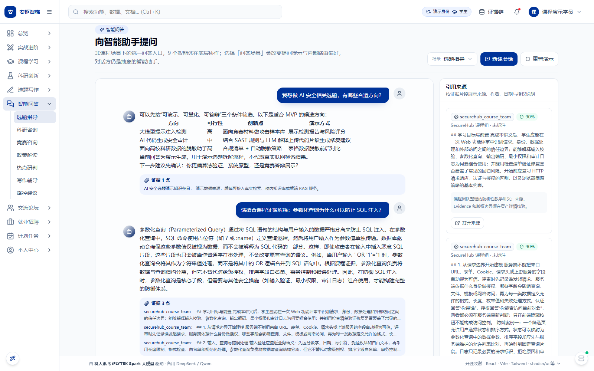
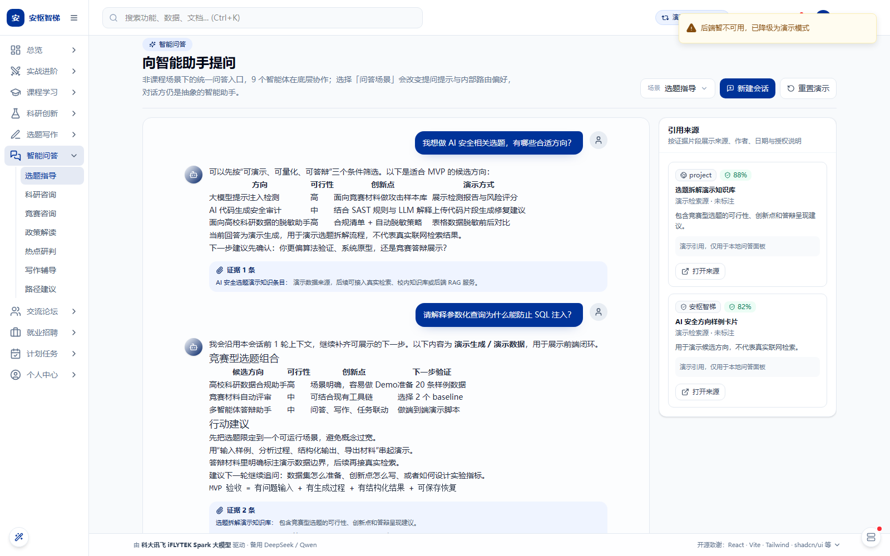
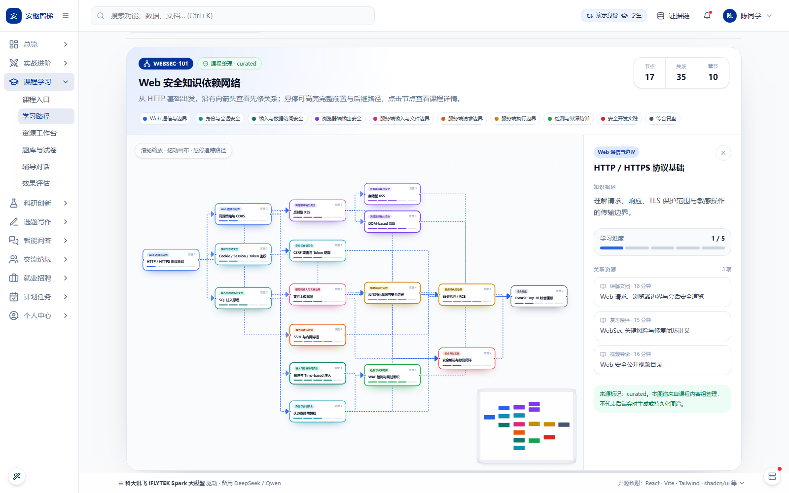
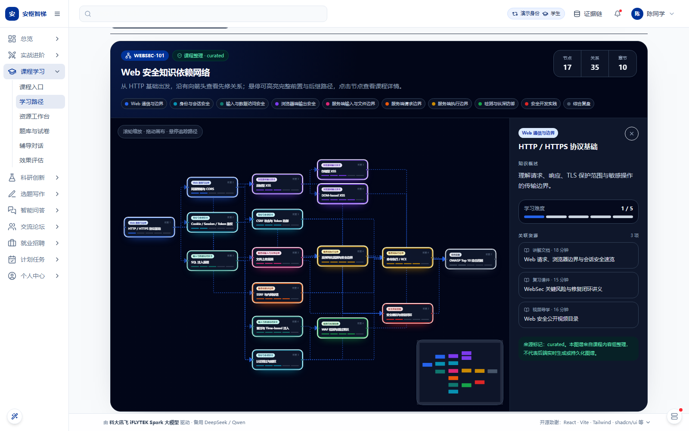

# 17-B-1 交付报告

## 概要

`/chat` 已接入 `tutor_routing_v3` 的真实 durable workflow 与 SSE 流，保留本地演示降级；WEBSEC-101 学习路径页新增由 17 个冻结知识点和 35 条先修关系派生的交互式 ReactFlow 知识图谱。

## 任务一：/chat 真实 LLM 对话

### 改动文件清单

- `frontend/src/app/features/chat/api.ts`：新增 338 行。增加 `streamChatReal()`、7 类 workflow 事件投影、场景路由提示、对话上下文、严格 JSON `content` 字段增量解码和终态结果校准。
- `frontend/src/app/pages/Chat.tsx`：新增 237 行、删除 59 行。接入真实流、逐段更新消息、实时引用、降级、`runId` 保存和 durable cancel。
- `frontend/src/app/features/chat/types.ts`：新增 4 行。`ChatCitation` 可保留完整 `EvidenceChunkDTO`，避免 CitationPanel 丢失真实来源、作者、授权和采集字段。

### 真实对话截图与日志



本地同时启动 PostgreSQL、Redis、现有后端和前端后，用 Demo 学生账号执行浏览器验收：

- 登录接口：HTTP 200。
- 问题：`请结合课程证据解释：参数化查询为什么可以防止 SQL 注入？`
- 首段可见内容：7.187 秒到达。
- 最终回答：400 个可见字符。
- CitationPanel：3 条真实 RAG 来源，均不含 `example.com`。
- 降级：未触发。
- 页面脚本异常：0。
- 第二轮回答点击停止后，浏览器实际发出 `POST /api/v1/workflow-runs/{runId}/cancel`。

真实 token 来自 `answer` 节点。前端增量解码 Skill 严格 JSON 输出中的 `content` 字符串，避免把内部 JSON 结构显示给学生；工作流成功后再用持久化终态结果校准最终文本。

### fallback 降级验证



关闭后端后发送任意问题，页面显示“后端暂不可用，已降级为演示模式”，随后完成本地演示回答；页面脚本异常为 0。`generateMockAnswer()` 与原 `streamChatAnswer()` 均保留。

### 已知限制

- `/chat` 当前复用已验收的 WEBSEC-101 `tutor_routing_v3` 上下文；超出课程证据域的问题可能因证据不足而进入显式演示降级。
- `progress`、`trace` 和 `artifact` 事件已由 `streamChatReal()` 正确消费并开放 handlers，但当前主聊天气泡未单独展示进度/轨迹面板。
- 浏览器离开页面只断开视图订阅，不冒充 durable cancel；只有用户点击“停止”才请求后端取消。

## 任务二：知识图谱可视化

### 改动文件清单

- `frontend/src/app/features/course/websec/WebSecurityKnowledgeGraph.tsx`：新增 473 行。实现自定义知识点节点、先修边、路径高亮、详情面板、资源关联、MiniMap 和明暗主题。
- `frontend/src/app/features/course/components/LearningPathWorkspace.tsx`：新增 51 行、删除 11 行。增加“知识图谱”视图、URL 状态恢复、按需加载和局部 ErrorBoundary。
- `frontend/src/app/features/course/websec/webSecurityCourseUrl.ts`：1 行调整。新增 `pathMode=graph`。

### 图谱截图





### 节点与边数量确认

- 节点：17。
- 有向先修边：35。
- 章节：数据源实际包含 10 个章节名称，组件按实际数据动态分色；未改写或合并冻结数据。
- 来源标记：`curated`，界面明确说明不是后端实时生成或持久化图谱。

### 接入方式

仅当稳定课程代码为 `WEBSEC-101` 时，学习路径工作区显示“个性化路径 / 课程路线图 / 知识图谱”三种视图。知识图谱用 `React.lazy` 单独加载，URL 为 `tab=path&pathMode=graph`；非 WEBSEC 课程继续只显示真实个性化路径。

节点位置来自 `demoRoutes.ts` 的课程路线坐标并做纵向比例适配；边由路线节点 `prerequisites` 反向解析为“前置知识点 → 当前知识点”。悬停会高亮完整祖先与后继路径，点击节点显示概述、章节、难度和关联资源。

### 已知限制

- 图谱是课程整理数据的只读探索视图，不写回后端，也不改变个性化学习路径。
- 35 条先修边在全局缩放时较密集，已通过平滑边、淡化非关联路径和 MiniMap 降低阅读负担。

## 验证命令输出

### `pnpm typecheck`

```text
> tsc --noEmit
退出码 0，零错误
```

### `pnpm build`

```text
vite v6.3.5 building for production...
✓ 6409 modules transformed.
WebSecurityKnowledgeGraph: 12.09 kB（gzip 4.48 kB，独立懒加载 chunk）
✓ built in 13.43s
```

构建仍提示两个既有 vendor chunk 大于 500 kB；本轮新增图谱已独立拆包，不增加该既有告警。

### 浏览器人工核验

```text
graph_nodes=17
graph_edges=35
non_websec_graph_entry=absent
chat_fallback_toast=visible
login_status=200
first_visible_content_ms=7187
final_answer_chars=400
real_evidence_links=3
fallback_used=false
durable_cancel_request=observed
page_errors=0
```

## 残余问题与后续建议

- 若未来开放非课程通用知识域，应在既有 workflow 契约内扩展受治理的 domain 路由，不要新增第 10 个智能体或裸调 LLM。
- 可在后续体验轮次把 `progress` / `trace` 投影为低权重中文状态条，但不应展示内部推理内容。
- 可为知识图谱增加键盘方向导航；当前点击、悬停、缩放和平移已满足本轮演示验收。
