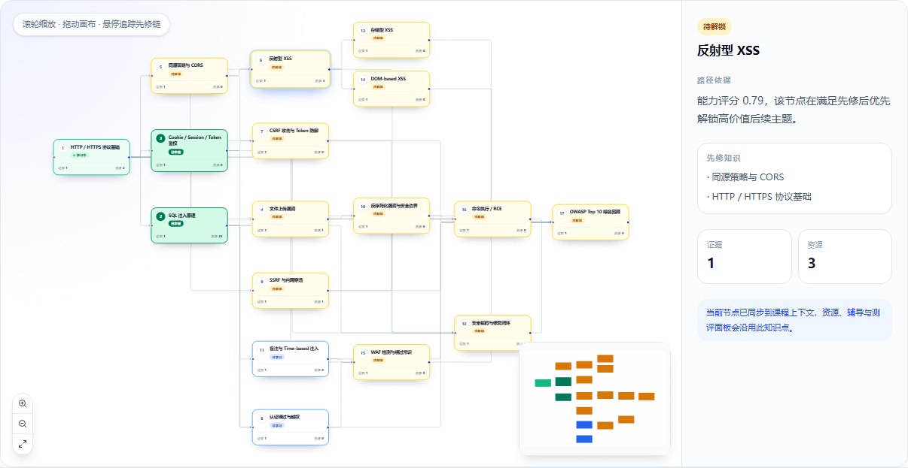
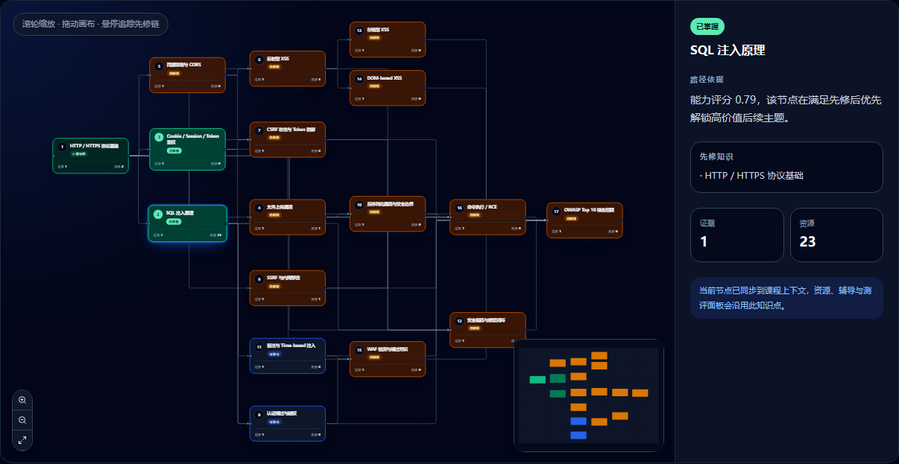
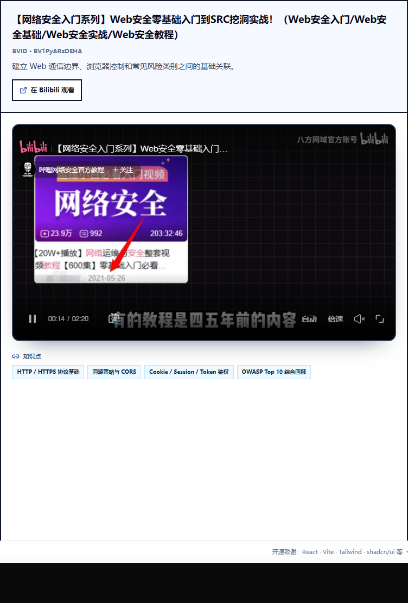

# 18-B-1 交付报告

## 概要

已将真实个性化学习路径从纵向卡片列表升级为 ReactFlow 有向图，并在 WEBSEC-101 课程资源目录中接入经过白名单校验的 Bilibili 嵌入播放器；Docker、后端与前端均保持原有运行方式，本轮未修改任何后端代码、API 契约或冻结数据文件。

## 任务一：LearningPathDAG ReactFlow 图化

### 改动文件

- `frontend/src/app/features/course/components/LearningPathDAG.tsx`
  - 当前 607 行。
  - commit `df79bd28`：新增 501 行、删除 74 行。
  - 保留 `useCourseProductPath`、课程 store/dispatch、selected course、loading/error/preview、真实进度、`generatedPath` 展开区和 `setCurrentKp` 行为。
  - 主渲染区改为 ReactFlow，自定义 `PathNode` 展示序号、中文状态、证据数与资源数。
  - 根据真实 `graph.edges` 渲染 smoothstep 有向边和箭头；悬停时以 BFS 收集全部前驱与后继并高亮关联路径。
  - 增加中文缩放/适应画布控制、MiniMap、详情面板和深浅主题样式。

### 图谱截图

真实接口返回并渲染 17 个路径节点、39 条先修边：



深色主题：



### 布局方案

采用方案 A，不增加依赖：

1. 读取 `demoRoutes.ts` 导出的首条 WEBSEC-101 路线坐标。
2. 后端真实节点使用 UUID，而课程整理路线使用 slug，因此以标准化知识点标题建立 UUID 节点到课程坐标的桥接。
3. 同时保留 `knowledge_point_id` 直接匹配能力；未来若后端返回 slug，可直接命中。
4. 未命中课程坐标的节点进入独立行列布局，避免未知课程节点重叠或导致白屏。

### 交互验证

- 真实 API：`graph/path/progress` 均返回 HTTP 200。
- DOM 与接口一致：17 个 `.react-flow__node`、39 个 `.react-flow__edge`。
- 状态分布：`locked=12`、`ready=2`、`in_progress=1`、`done=2`，颜色和中文状态标签均可见。
- 悬停“反射型 XSS”时，10 条前置/后继关联边进入动画高亮。
- 点击“反射型 XSS”后：
  - 详情标题切换为“反射型 XSS”。
  - UUID `46101976-aab8-5402-8e71-012a00740fa8` 写入 `securehub-course-state.taskContext.kpId`，证明 `setCurrentKp` 全局课程上下文联动生效。
- 拖拽平移后 viewport 从 `translate(69.4551px, 28.1818px)` 变为 `translate(189.455px, -31.8182px)`。
- 中文“放大 / 缩小 / 适应全部路径”控制均可点击；MiniMap 可平移和缩放。
- 非 WEBSEC 的 CRYPTO-101 正常显示只读预置知识点，ReactFlow 数量为 0，不复用 WebSec 路线。
- 通过浏览器拦截 `graph/path/progress` 模拟后端不可用时，显示可见错误卡片，页面未白屏。
- `generatedPath` 独立区域的条件渲染、展开详情和节点联动代码均保留。

### 已知限制

- 后端 UUID 与课程整理 slug 不同，当前优先依赖冻结知识点标题匹配精心坐标；若未来标题发生整体变更，节点会安全降级到行列布局，但不再使用课程整理坐标。
- 17 节点全图首次 `fitView` 会缩小节点，用户可通过滚轮或中文控制按钮放大查看。

## 任务二：Bilibili 视频嵌入播放器

### 改动文件

- `frontend/src/app/features/course/websec/BilibiliEmbedPlayer.tsx`
  - 新增 49 行。
  - 校验 12 位 BVID 格式，构造 `player.bilibili.com` URL，并调用 `isAllowedWebSecurityExternalUrl()` 复核白名单。
  - iframe 使用 16:9、懒加载、无 Referer、受限 sandbox 和 fullscreen 权限。
- `frontend/src/app/features/course/websec/WebSecurityResourceCatalog.tsx`
  - 当前 1314 行；commit `2ac7b9c0` 新增 21 行、删除 5 行。
  - `VideoWorkbench` 优先展示嵌入播放器；BVID 缺失或 URL 校验失败时继续使用原 `VideoCover`。
  - 每条原平台链接和详情区“在 Bilibili 观看”按钮均保留。
  - 当前选中视频增加“播放中”标记。

### 嵌入播放器截图



### URL 与播放器验证

- 合法 BVID `BV1PyARzDEHA` 生成：
  - `https://player.bilibili.com/player.html?bvid=BV1PyARzDEHA&high_quality=1&danmaku=0`
- 空 BVID、恶意 URL 文本和错误长度 BVID 均返回 `undefined`，触发封面降级路径。
- iframe 属性：
  - `allow="fullscreen"`
  - `sandbox="allow-scripts allow-same-origin allow-popups"`
  - `loading="lazy"`
  - `referrerPolicy="no-referrer"`
- 首个视频和切换后的 `BV1Zw4m1y7BX` 播放器请求均返回 HTTP 200。
- 切换视频后 iframe src、URL 中的 `videoId`、唯一“播放中”标记和原站链接同步更新。
- iframe 内部确认存在 1 个 `<video>`、8 个控制节点，页面标题为“External Player - 哔哩哔哩嵌入式外链播放器”。
- 390 px 窄屏下 iframe 尺寸为 `327.52 × 184.22`，比例 `1.778`，与 16:9 一致。
- 深色模式下播放器容器使用深色边框和背景。

### 已知限制

- 播放内容、自动静音策略、清晰度可用性和播放器 UI 均由 Bilibili 控制；平台未来调整 CSP、嵌入策略或公开视频状态时可能影响播放。
- 网络加载失败仍由浏览器/Bilibili 播放器呈现；本轮明确要求的封面 fallback 覆盖“无 BVID”和“白名单校验失败”两类情况。
- SecureHub 不下载、转码或重新托管任何视频内容。

## 验证命令输出

### `pnpm typecheck`

```text
> tsc --noEmit
退出码 0，零 TypeScript 错误。
```

### `pnpm build`

```text
vite v6.3.5 building for production...
✓ 6410 modules transformed.
✓ built in 31.70s
退出码 0。
```

构建仍提示仓库既有的大 chunk 警告（`vendor-charts`、`vendor-resource`），不影响本轮成功构建。

### 浏览器验收环境

- 登录账号：`demo-student@securehub.local`。
- 真实服务：前端 `localhost:5173`，后端 `127.0.0.1:8000`。
- 系统 C 盘可用空间为 0 MB，Python Playwright 临时环境无法创建；验收改用工作区预装的 Node Playwright，并将所有临时目录定向到 D 盘。未修改项目依赖或锁文件。
- 本轮组件未产生 `pageerror`。

## 残余问题与后续建议

1. 浏览器控制台仍能观察到本轮之前已存在的 `student-experience` / `learning-loop` CORS 失败，以及 `StudentCourseExperiencePanel` 资源选项重复 key 警告；它们不来自本轮三个改动文件，且不影响 ReactFlow 与播放器验收，建议另开回归任务处理。
2. 若后端未来支持动态新增知识点，建议在 API 层补充稳定的课程 slug 或布局层级字段，减少标题桥接。
3. Bilibili 嵌入能力应在赛前演示环境再次联网回归，并保留“在 Bilibili 观看”作为平台策略变化时的人工出口。
