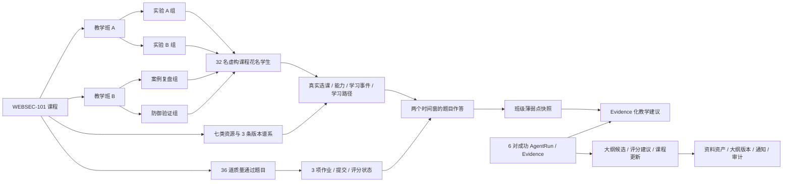

# WEBSEC-101 受控课程场景：页面数据依赖台账

## 目的与边界

本台账对应 `showcase_course` 受控 seed profile。它把 WEBSEC-101 的预置教学场景写入现有数据库关系，供已有权限与 API 消费；不创建新的 Runtime、Skill 或前端假数据通道。

- 仅限本地、比赛演示或明确授权测试环境，通过 `SECUREHUB_ALLOW_SHOWCASE_SEED=1` 显式执行。
- 虚构学生均为课程花名，不是现实在校学生；固定讲义、资源与外链必须在详情保留 `curated-demo` / 外部来源边界。
- 预置的成功 `AgentRun` / `Evidence Snapshot` 是持久化的受控课程记录，不得表述为本次浏览器操作实时生成。
- 生产默认禁用。真实 PostgreSQL migration、浏览器端到端、Spark/live Provider、COS 与部署检查不属于本阶段签收。

## 关系图

## 页面与 API 台账

| 体验入口 | 真实读取路径 / 数据依赖 | seed 最小密度 | 数据不足时的正确状态 | 后续人工验证 |
| --- | --- | --- | --- | --- |
| `/teacher` | `GET /api/v1/teacher/production/dashboard`、课程授权、班级、选课、作业与资产统计 | 1 位课程教师、2 个班 | 无教师授权时 403，不展示伪教师身份 | 登录课程教师，确认 WEBSEC-101 卡片与统计来自 API |
| `/teacher/materials` | `GET /teacher/production/courses/{course_id}/assets`、`GET /teacher/production/assets/{asset_id}/knowledge-detail`；统一 `documents`、`document_assets`、`chunks`、binding、asset governance | 3 个受治理资产，含 1 份受控预置防御讲义、7 个可追溯 chunks | 无资料时提示登记讲义并完成处理；不要求 document UUID | 查看来源、处理时间线、章节/块、知识点关联和绑定理由；预置处理结果不称为刚刚解析或已完成实时向量化 |
| `/teacher/quiz-bank` | 题库质量 API、`quiz_items`、`quiz_item_evidence`、`quiz_quality_reports` | 36 道，4 类题型，均 `curated + passed` | 题目未通过质量门时不可组卷 | 查看题目、解析、知识点与 Evidence，确认没有草稿题进入作业 |
| `/teacher/assignments` | assessment/version/item/assignment/submission/grade 真实链；学生读取 `GET /teaching/assessment-assignments/{assignment_id}` 与提交 API | 3 项作业、26 份提交、待批/已发布/教师覆盖/撤回 | 无合格题或无目标班级时显示缺失依赖和跳转 | 选择作业，查看学生提交与成绩状态；学生只读取不含答案的已发布题目快照，发布/撤回均保留审计 |
| `/teacher/teaching-insights` | weakness snapshots、recommendations、真实作答、AgentRun/Evidence | 2 个班各 2 个时间窗、2 条建议、6 对关联运行/证据 | 有选课但无可评分作答时只显示样本不足，不产生薄弱结论 | 核对样本、覆盖率、时间窗、趋势与 Evidence 详情 |
| `/teacher/syllabus` | course syllabus/version/review，关联 AgentRun/Evidence 或 typed draft | 2 个版本，1 个 published、1 个 review_pending | 无合法运行/证据时允许教师 typed draft，不允许伪造生成候选 | 查看版本、差异、审核与回退，不自动覆盖已发布课程 |
| `/teacher/notices`、`/teacher/course-updates` | messages/deliveries、course update signal/impact/decision | 2 条通知、2 条课程更新、不同状态 | 无受众或无来源时不发送空通知 | 核对受众、时间、任务、链接和课程更新审核状态 |
| `/teacher/production/courses/{course_id}/preflight` | 选课、可评分作答、题目质量、资产、snapshot、成功 AgentRun/Evidence | 默认阈值 10；输出可行动依赖状态 | 明确列出缺失对象与下一步，不接受 UUID 文本替代 | 以课程教师令牌调用，指定班级后核对计数与五类动作状态 |
| `/course` 学生课程入口 | 选课、画像、能力、路径、学习事件、资源、作答与已发布成绩 | 32 名差异化学生与五类学习故事 | 未选课或资源未就绪时引导选课/重试，不显示随机成绩 | 阶段 5 将把这些关系接入六个标签页后验证跨页一致性 |

## 前置依赖与空态清单

| 教师动作 | 必需事实 | 受控 seed 提供 | 依赖不足时必须显示 |
| --- | --- | --- | --- |
| 计算薄弱点 | 课程授权、班级/选课、至少阈值人数的可评分作答 | 班级 A 有 16 名、班级 B 有 16 名可评分学生 | 有效选课数、已评分数、覆盖率、阈值与“补齐真实作答”动作 |
| 填充作业草稿 | 目标班级、已发布且质量通过题目 | 36 道合格题、3 项真实作业链 | 可用题数不足；跳转题库审核，绝不放行草稿题 |
| 提交大纲候选 | typed 内容，或成功且关联的 AgentRun/Evidence pair | 6 对，且课程范围写入持久化摘要/快照 | 未找到合法 pair；允许教师写 typed draft，不展示伪 UUID 输入 |
| 提交教学建议 | 薄弱点快照、课程范围的合法 AgentRun/Evidence pair | 4 个 snapshot、2 条建议 | 无快照/无 Evidence；提示先计算或选择实际对象 |
| 绑定资料 | 当前课程的统一文档与可用资产 | 3 个资料资产，其中 1 份为显式标注的受控预置讲义与 7 个 chunks | 资料未处理或已撤回；提示在已启用统一摄取环境上传、处理、审核或恢复，不能用页面进度冒充成功 |

## 截图与浏览器人工验证清单

1. `http://127.0.0.1:8000/docs`：以课程教师 JWT 调用 `GET /api/v1/teacher/production/courses/{course_id}/preflight`，选择 WEBSEC-101 班级 A。预期显示真实计数、五个动作的 `ready=true` 和无 UUID 伪造输入。
2. `http://127.0.0.1:5173/teacher/quiz-bank`：登录课程教师后查看质量通过题库。预期可见至少四种题型、题目解析和 Evidence/质量状态；截图需说明内容为受控预置课程整理。
3. `http://127.0.0.1:5173/teacher/assignments`：选择 WEBSEC-101 作业。预期可看到提交、已发布、教师覆盖、待批和撤回等真实持久化状态；从题库页仅可使用已发布且质量通过题目组卷。
4. `http://127.0.0.1:5173/teacher/teaching-insights`：选择班级和时间窗。预期必须展示样本与覆盖率，再展示薄弱点和 Evidence 化建议；小样本不能称为薄弱结论。
5. `http://127.0.0.1:5173/teacher/materials` 与 `/teacher/syllabus`：在资料页展开“处理详情”。预期可看到持久化的文件大小、章节/块、处理时间线、知识点关联和块样例；预置讲义必须显示为已处理的受控内容，向量化待处理不能伪装为已完成。大纲页继续核对版本、审核和 Evidence 关联。
6. `http://127.0.0.1:8000/docs`：以已选课学生 JWT 调用 `GET /api/v1/teaching/assessment-assignments/{assignment_id}`。预期仅返回已发布题目快照，不能包含答案或解析；用版本外题目 ID 提交时必须被拒绝。
7. `http://127.0.0.1:5173/course`：阶段 5 完成后，用不同虚构学生账户核对资源、作答、成绩和路径差异。截图应说明学生花名和预置课程内容来源边界。

浏览器未启动、登录不可达或首个关键动作失败时，记录 URL、操作、实际阻塞与预期，不以截图替代 API/数据库验证。
