# 安栈智梯挑战赛新增功能总结

Status: real

日期：2026-08-01

目标分支：`upstream/dev`

截图来源：`D:\Nnutural\Desktop\BUPT大全\BUPT竞赛\26软件杯\pic\挑战赛`

> 为保证 GitHub 与 PR 页面可以直接展示，本文将上述目录中的功能截图复制到 `Workout/assets/challenge/` 后使用相对路径引用；原始截图未被修改。

## 1. 交付概览

本轮围绕“可信智能问答、个性化课程、多模态教学、知识图谱”完成了可运行的学习闭环：

| 能力 | 新增内容 | 用户价值 |
|---|---|---|
| 智能问答 | 接入真实 durable workflow、SSE 流式回答、证据引用、取消与演示降级 | 回答过程可观察、结果可追溯，服务异常时页面仍可用 |
| 智能体工作记录 | 展示规划、检索、协作、媒体调用与完成/失败动作 | 体现智能体在做什么，但不暴露模型内部思维链 |
| 个性化学习路径 | 将真实路径升级为 ReactFlow 有向图，支持状态、详情、缩放、平移、路径高亮 | 学生可以直观看到先修关系和当前学习位置 |
| 多模态课程资源 | 增加教学图解、原生视频、Bilibili 白名单嵌入、详情与来源信息 | 同一知识点可以通过文字、图解和动画共同学习 |
| 对话内媒体生成 | Chat 中提供图片/视频预设、自定义提示词、生成进度、结果内联与失败重试 | 不离开对话即可生成或调取教学媒体 |
| VOSviewer 知识图谱 | 圆形气泡、章节聚类、密度层、自适应标签、路径追踪和网络统计 | 从课程目录升级为可探索的概念网络 |
| 跨课程网络 | 叠加 CRYPTO-101、NET-SEC-201、SDL-201 的 10 个概念节点 | 展示 Web 安全与密码学、网络安全、安全开发的知识迁移关系 |

## 2. 智能问答与可审计工作过程

`/chat` 复用既有 9 个智能体体系，通过真实工作流执行课程问答。前端消费工作流事件并逐段渲染回答，同时保留引用来源、运行 ID、停止请求和后端不可用时的明确演示降级。

新增的消息渲染接近 Codex、GPT 和 Claude 的阅读体验：正文、活动记录与证据来源分层呈现；活动面板只展示可审计动作，例如理解问题、建立工作流、检索证据、调用媒体服务和整理答案，不展示内部推理文本。

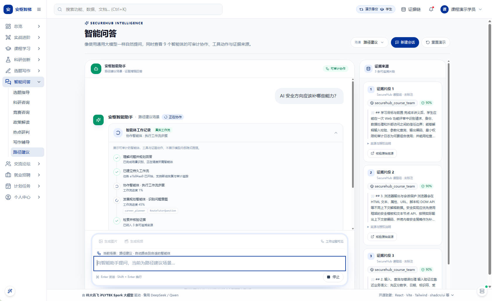

工作完成后，回答与工作记录保持在同一条助手消息中，便于学生回看执行过程。

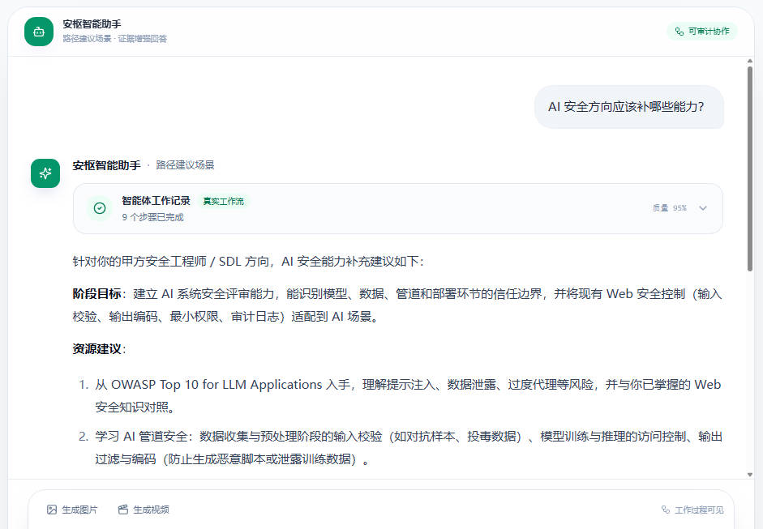

## 3. ReactFlow 个性化学习路径

真实个性化路径由纵向列表升级为有向图：

- 展示 17 个 WEBSEC-101 知识节点和真实先修边。
- 节点使用“待解锁、可学习、学习中、已掌握”等状态区分。
- 悬停时通过 BFS 高亮完整前驱和后继路径。
- 点击节点后联动课程上下文、证据数、资源数和详情面板。
- 支持滚轮缩放、拖动画布、MiniMap、适应画布以及明暗主题。
- 非 WEBSEC 课程保持原有安全降级，不错误复用固定布局。

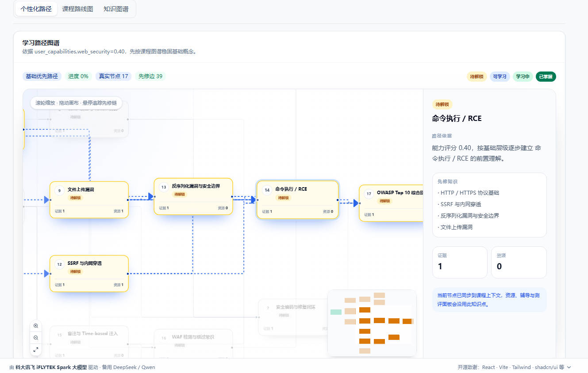

## 4. 课程内多模态教学资源

WEBSEC-101 的课程学习页新增“图解 / 动画”视觉讲解区域。图片卡支持来源信息和详情查看，视频使用原生播放器；外部 Bilibili 视频只接受合法 BVID 和白名单域名，并保留原平台入口。

精选教学图将抽象协议和安全边界转换为带中文标签的结构化图示：

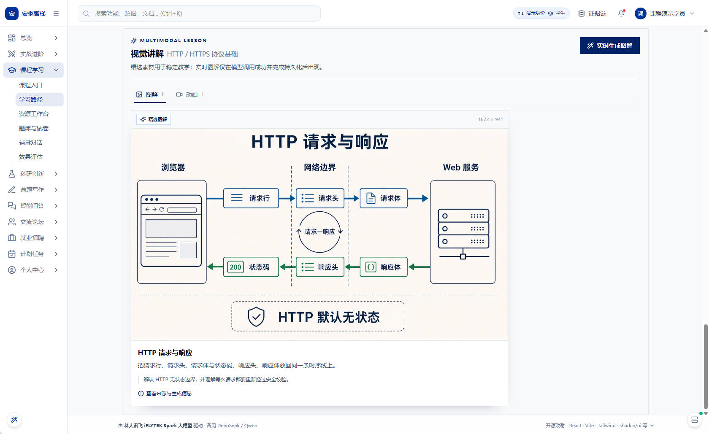

教学动画使用 16:9 播放器，配套标题、时长、讲解摘要和来源信息：

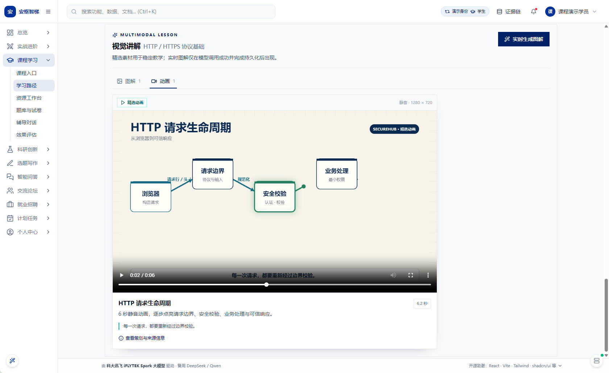

## 5. 对话内图片与视频能力

### 5.1 图片生成

Chat 输入区新增“生成图片 / 生成视频”入口，可从 WEBSEC-101 知识点预设中选择，也可输入自定义提示词。媒体请求不进入普通问答 SSE，而是创建独立的助手占位消息和媒体工作活动。

图片生成链路使用火山方舟 Agent Plan 图像接口，当前默认模型为 `doubao-seedream-5.0-lite`，请求规格为 `2K`、PNG、无水印。生成结果先由后端下载并安全持久化，再通过鉴权 Blob 在消息中展示。

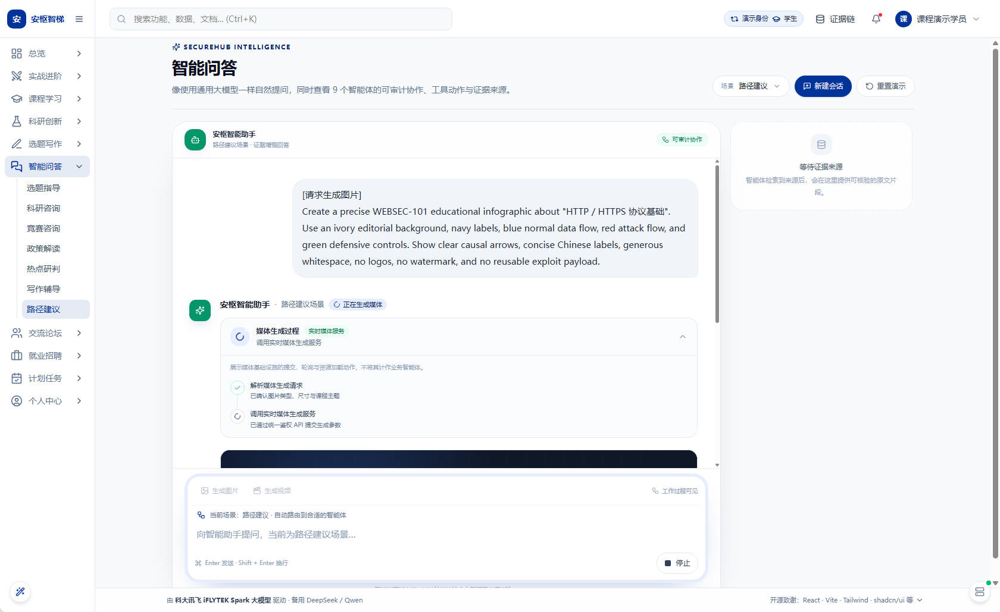

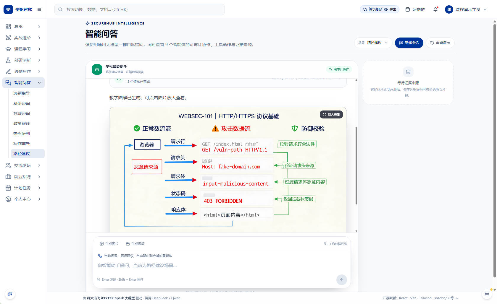

### 5.2 视频生成与本地教学视频

后端新增 Google Omni 代理视频任务的提交、轮询、下载、持久化和鉴权读取能力。上游失败时，界面展示脱敏错误和“修改后重试”，不会伪造成功或自动再次付费提交。

针对已人工生成并验收的 HTTP/HTTPS 教学视频，前端支持精确提示词匹配后使用仓库内本地 MP4：

- 命中时不请求远程视频生成接口。
- 发送后保留约 1.6 秒、可被停止的准备缓冲，不会瞬间弹出结果。
- 工作记录继续展示“解析媒体请求 → 匹配本地课程媒体 → 准备视频资源”。
- 界面不显示“预生成资源”标签，也不在视频画面叠加水印或特殊标记。
- 本地文件缺失时直接报告错误，不静默回退到付费服务。

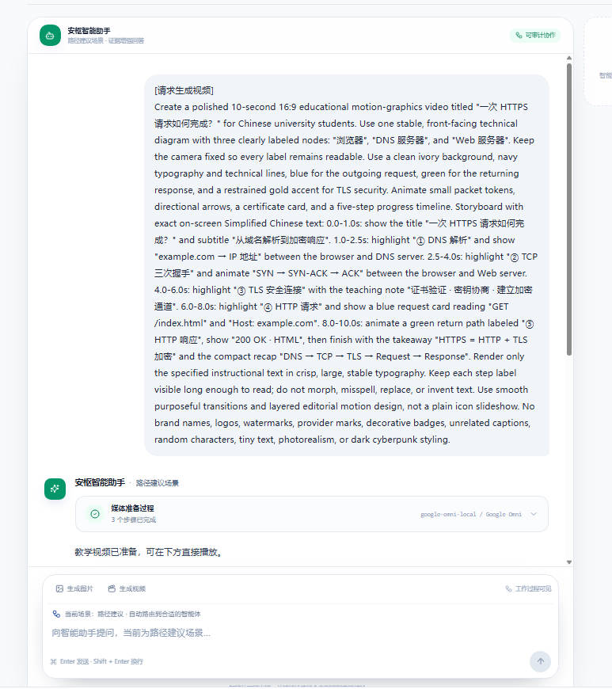

视频内容包含 DNS、TCP 三次握手、TLS 证书校验、HTTP 请求和响应等可阅读的教学文字：

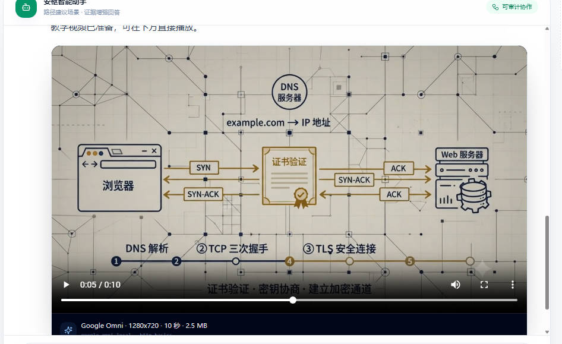

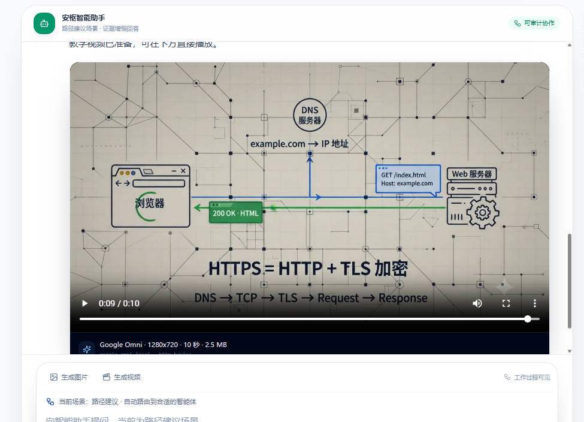

## 6. VOSviewer 风格知识图谱

知识图谱由矩形流程节点升级为概念密度网络：

- WEBSEC 节点使用圆形气泡，大小由资源数和题目数共同决定。
- 10 个章节使用稳定色组，Canvas 径向渐变形成密度叠加效果。
- 标签随缩放级别切换为章节、简称或完整标题。
- 边使用加权 Bezier 曲线；跨章节弱关系使用虚线。
- 悬停节点时高亮完整关联路径，其他节点和边自动淡化。
- 详情侧栏展示入度、出度、连接度、近似 PageRank、章节学习密度和难度分布。

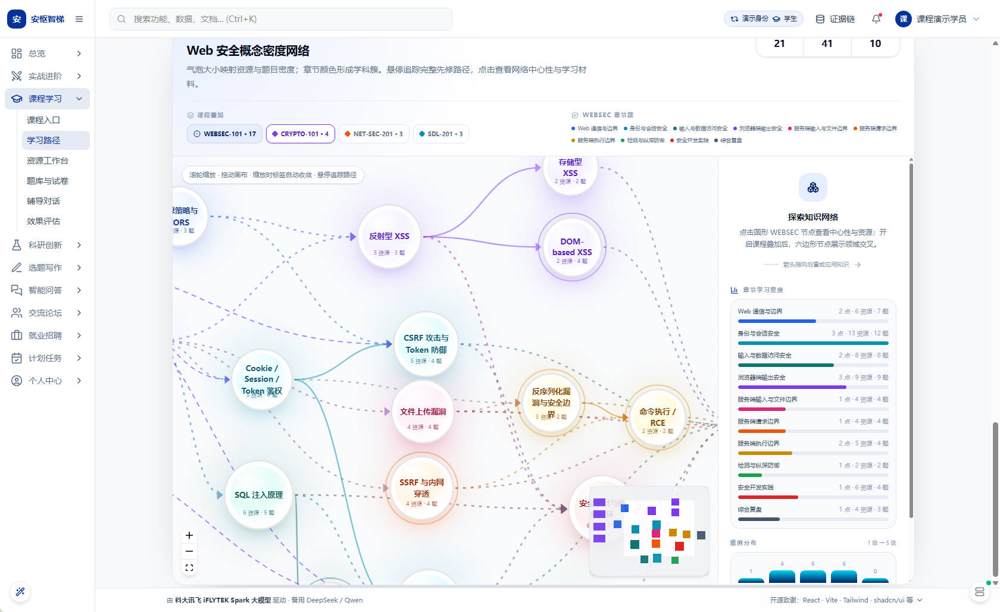

## 7. 跨课程知识网络

图谱支持按课程开关叠加 10 个跨课程概念节点：

| 课程 | 节点数 | 典型关联 |
|---|---:|---|
| CRYPTO-101 | 4 | TLS、哈希、对称加密、公钥体系 |
| NET-SEC-201 | 3 | 防火墙与 ACL、IDS/IPS、DNSSEC |
| SDL-201 | 3 | 安全开发生命周期、代码审计、威胁建模 |

跨课程节点使用六边形、课程专属颜色和虚线关系；默认仍只展示冻结的 17 个 WEBSEC 节点，全部开启后共 27 个节点。选择节点后可查看跨课程路径与网络统计。

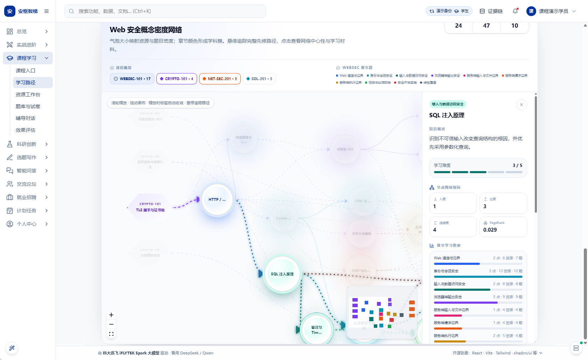

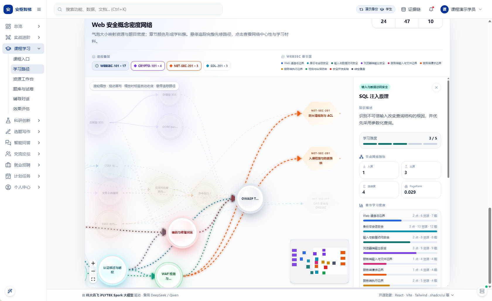

## 8. 后端接口与安全边界

新增或扩展的媒体接口：

```text
POST /api/v1/media/generate-image
GET  /api/v1/media/assets/{kp_id}/{asset_filename}
POST /api/v1/media/generate-video
GET  /api/v1/media/video-status/{task_id}
GET  /api/v1/media/video-assets/{asset_filename}
```

安全措施包括：

- API Key 只从后端环境配置读取，示例文件只保留占位符。
- 媒体下载仅允许 HTTPS，拒绝凭据 URL、localhost、`.local`、私网和保留地址。
- 每次重定向重新执行域名解析与公网地址校验。
- 同时限制声明大小和流式累计大小。
- 图片通过 PNG/JPEG/WebP 魔数校验；视频通过 MP4/WebM MIME 与魔数校验。
- 任务索引、媒体对象和读取接口均按登录用户隔离。
- 上游错误经过固定文案转换，不回显密钥、临时下载地址或完整响应。

## 9. 验收结论

| 检查项 | 结果 |
|---|---|
| 后端图片、视频服务与 API 自动化测试 | 通过 |
| 前端 TypeScript 类型检查 | 通过 |
| 前端生产构建 | 通过 |
| ReactFlow 学习路径与图谱浏览器验收 | 通过 |
| 图片生成进度、结果与灯箱 | 通过 |
| 视频失败、停止、重试和本地播放 | 通过 |
| 本地视频缓冲期间不提前出现播放器 | 通过 |
| 本地视频命中时远程生成请求数 | 0 |
| 390 px 窄屏横向溢出 | 0 px |
| 页面脚本异常 | 0 |

## 10. 治理约束

- 始终保持既有 9 个智能体，媒体服务属于横切基础设施，不新增第 10 个智能体。
- 未修改冻结的 WEBSEC-101 知识点 ID、路线和基础数据定义。
- 生成式能力继续遵守先检索证据、后生成回答的工作流治理。
- 精选课程素材、本地教学视频和实时生成结果在数据层保留真实来源，不把本地文件伪装为本轮实时生成。
- 智能体工作记录展示可审计动作，不展示模型内部思维链。
